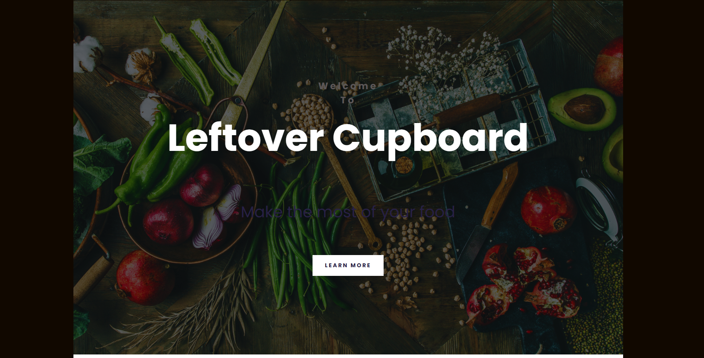
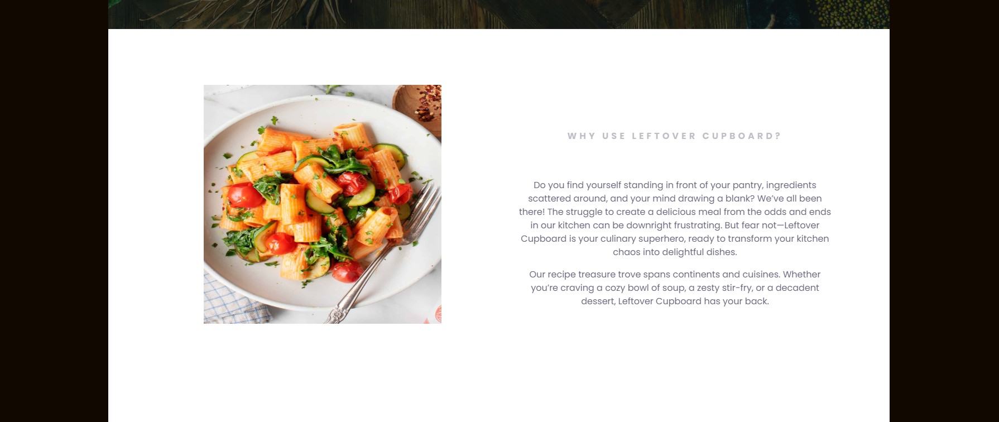
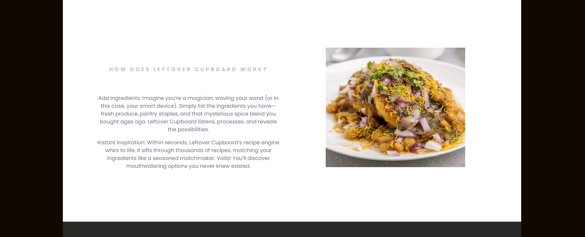
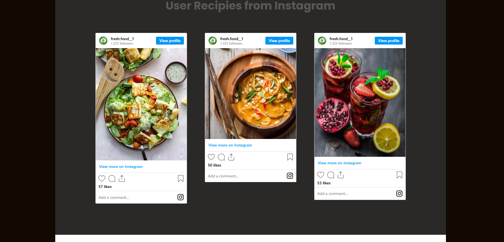
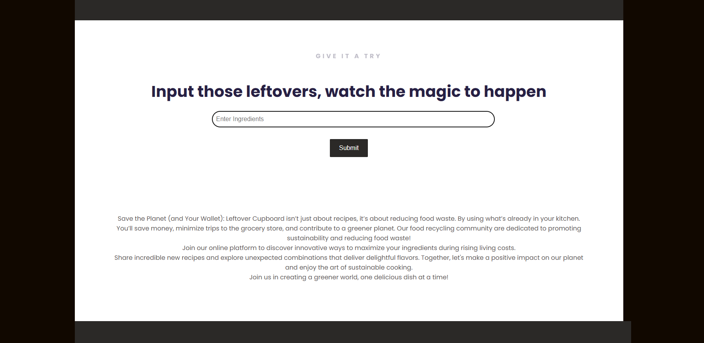
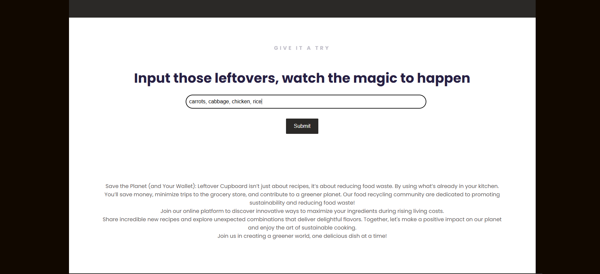
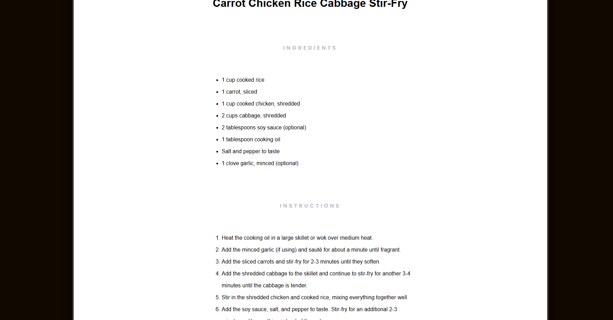
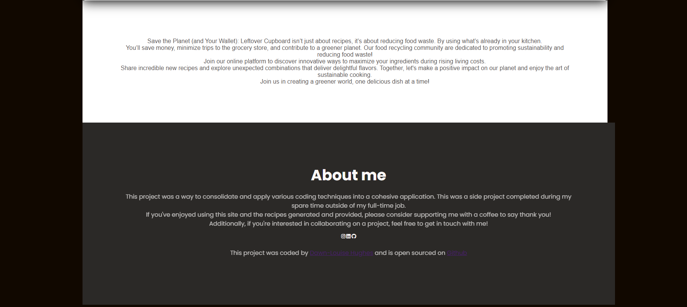

#  Leftover Ingredient Recipe Generator

##  Project Overview

This project is a JavaScript-powered web application that allows users to input their leftover ingredients and generates a meal idea along with a complete recipe. It aims to reduce food waste by helping users make the most of what they already have in their kitchen.

This project is a culmination of skills developed in my previous projects, including the Travel Website and AI Limerick Generator. By leveraging front-end development, API integration, and user experience principles, I have built a solution that is both practical and impactful.
## Project Preview
Here's how the application looks:

#  Technologies Used

- HTML, CSS, JavaScript – Core technologies for structuring and styling the website.

- API Integration – Fetching and processing recipe data based on user inputs.

- Responsive Design – Ensuring accessibility across devices.

#  Features

- ✅ Ingredient Input: Users can enter available ingredients to receive tailored meal suggestions.
- ✅ Recipe Generation: The system retrieves and displays a complete recipe based on the provided ingredients.
- ✅ Dynamic UI Updates: Recipes are displayed interactively without requiring page reloads.
- ✅ User-Friendly Design: Clean and intuitive interface for seamless user experience.
- ✅ Mobile Responsiveness: Optimized for desktops, tablets, and mobile devices.

#  Skills Demonstrated

This project demonstrates my growing expertise in front-end web development, problem-solving, and user-centric design. Key skills include:

- JavaScript Logic & DOM Manipulation – Enhancing interactivity and responsiveness.

- API Handling – Efficiently retrieving and displaying external data.

- UI/UX Principles – Designing an accessible and engaging user interface.

- Project Structuring & Code Readability – Writing modular and maintainable code.

- Debugging & Error Handling – Ensuring smooth application functionality.

##  Why This Project Matters

With food waste being a global issue, this application serves as a practical tool to encourage sustainability while showcasing my ability to develop real-world solutions. By integrating skills from my previous projects, I continue to refine my ability to build useful and engaging web applications.

##  Future Enhancements

-  Database Integration: Allow users to save their favorite recipes.

-  AI-Based Recipe Suggestions: Use machine learning to improve meal recommendations.

-  Community Feature: Enable users to share their own recipes and experiences.

##  How to Run This Project

Clone the repository:

git clone https://github.com/FedDawb/Recipie-Generator

Open index.html in a web browser.

Enter ingredients and generate your recipe!

##  Let's Connect!

If you're interested in collaborating or discussing my work, feel free to reach out on LinkedIn or check out more of my projects on GitHub.

 I’m actively growing my skills in JavaScript, API development, and user experience design. Let’s build something amazing together!
